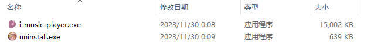
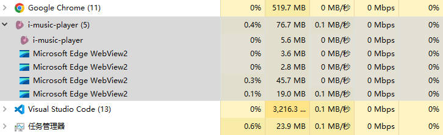
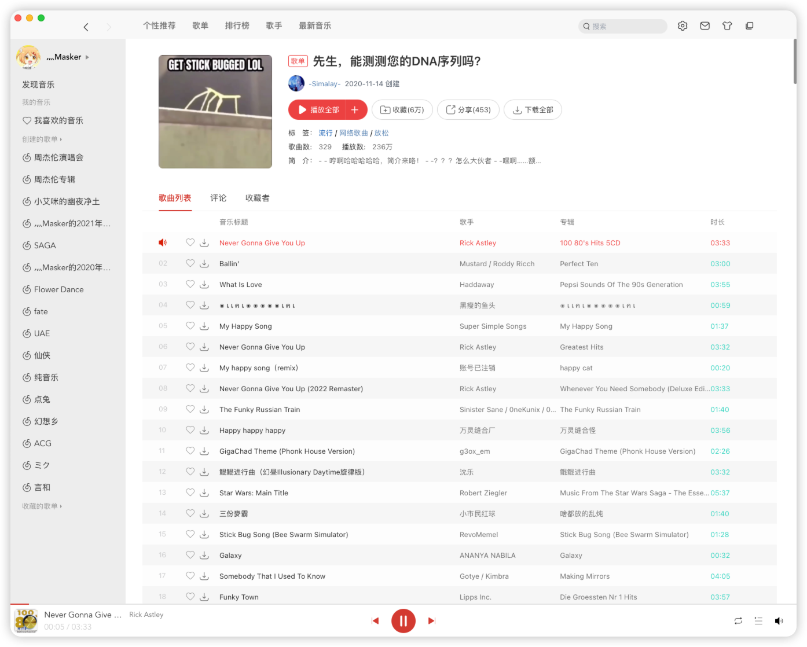
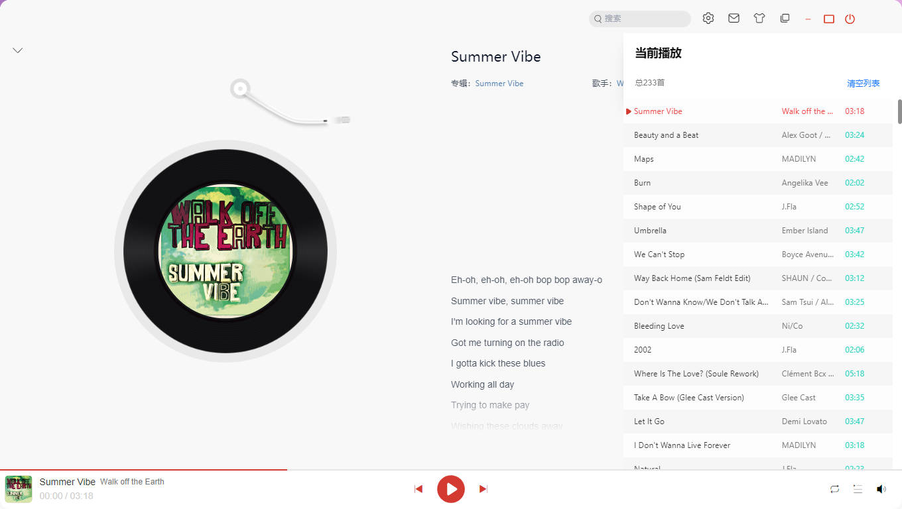

<div align="center">
  

  <h1>I-MUSIC-PLAYER</h1>

  <strong>仿网易云音乐Mac风格的音乐播放器</strong>

  <div>
  
  [](https://www.rust-lang.org/)&nbsp;&nbsp;[](https://www.typescriptlang.org/)&nbsp;&nbsp;[](https://tauri.app/)&nbsp;&nbsp;[](https://vitejs.dev/)&nbsp;&nbsp;[](https://react.dev/)

  </div>
  
  <a href="https://github.com/mi-saka10032/i-music-player/releases" target="blank"><strong>📦️ 下载安装包</strong></a>

</div>

## ✨ 特性

- **Tauri 跨端开发，Windows、Mac、Linux 通用**
- **安装包体积极小，应用体积极小、运行内存占用极低（自身内存消耗仅 10M 不到）**
- **网易云账号登录（目前仅支持扫码登录）**
- **核心播放功能完整，登录后支持查看已创建歌单、已收藏歌单、显示歌词**
- **支持播放列表与播放状态持久化**
- **个人服务器友情提供部分（Jay Zhou）精选歌曲**
- **2023/12/2：更新v0.0.3版本，布局、样式、构建全面优化，并且播放歌曲时优先获取HiRes音质歌曲链接**
- **2023/12/4：更新v0.0.4版本，解决长时间播放卡死问题**
- **2024/8/5：更新v0.0.5版本，缓存、随机播放等方案优化调整，代码优化**






## Mac安装限制

注意：由于新版本使用了PrivateMacAPI，在mac上安装后如果提示软件已损坏，请按照以下步骤解除应用限制：

1. 终端输入：sudo spctl --master-disable，回车后会提示输入电脑密码

```bash
sudo spctl --master-disable
```

2. 输入命令：（复制粘贴进去，cr后面输入一个空格）。注意⚠️：cr 后面输入一个空格！不要回车！

```bash
xattr -cr 
```

3. 从应用程序或桌面上，将出现已损坏的软件拖入终端中（xattr -cr 的后面）

4. 回车执行后，重新打开软件

## ☑️ Todo

- **作为 Rust+React 练习项目，除了首页展示、歌单详情查询与核心播放功能之外，其他功能有待开发 😅️**
- **欢迎提 Issue 和 Pull request**

## 💻 配置开发环境

本项目由 [NeteaseCloudMusicApi](https://github.com/Binaryify/NeteaseCloudMusicApi) 提供 API 路径和加密算法。

### ❤️ 安装 Rust

请先按照[Tauri 安装指南](https://tauri.app/zh-cn/v1/guides/getting-started/prerequisites#%E5%AE%89%E8%A3%85)配置 Rust 环境

要检查您是否正确安装了 Rust，请打开终端并运行如下命令：

```bash
rustc --version
```

您应该能看到以下列格式呈现的版本号、提交哈希及提交日期：

```bash
rustc x.y.z (abcabcabc yyyy-mm-dd)
```

### 🔥 推荐 IDE 与扩展

使用以下 IDE 和扩展，会有最佳的开发体验

- [VS Code](https://code.visualstudio.com/)
- [Tauri](https://marketplace.visualstudio.com/items?itemName=tauri-apps.tauri-vscode)
- [rust-analyzer](https://marketplace.visualstudio.com/items?itemName=rust-lang.rust-analyzer)

### 👷‍♂️ 运行项目

- 进入项目后，等待 VsCode 下方的 rust-analyzer 插件自动拉取 rust 依赖并输出产物到 src-tauri/target 目录下，直到 rust-analyzer 左侧的 loading 图标消失


tips：国内 rust 依赖拉取较慢，建议配置 rsproxy 代理

- 安装 frontend 依赖

```bash
pnpm install
```

`tauri-plugin-sql-api` 依赖是从 github 的 https 路径拉取，注意网络配置

- 启动本地 App

```bash
pnpm local:dev
```

第一次启动会很慢，请耐心等待。

**Windows 环境可能会抛出两个异常**

1. openssl not found：需要 windows 环境安装 [openssl](https://slproweb.com/products/Win32OpenSSL.html)。亲测选择最低版本 v1.1.1w 安装即可
2. perl not found：需要 windows 环境安装 [perl](https://strawberryperl.com/)

**Mac 环境暂时未发现安装异常**

**注意：不要使用 pnpm dev 启动项目！应用需要由 tauri 来引导启动**

## 👷‍♂️ 打包项目

打包项目，有几个国外依赖（nsis、wix）很难拉取，建议按照网上的教程下载到本地再打包

```bash
pnpm local:build
```

安装包位置在 `src-tauri/target/release/bundle/`

## ⚙️ 部署项目

<a href="./.github/workflows/release.yml">release.yml</a> 文件提供 github 的 actions 一键部署

```bash
git tag v0.0.1
```

```bash
git push --tags
```

## 📜 许可证

[MIT © 2023 mi-saka10032](./LICENSE)

## 灵感来源

核心框架建设来自 [https://github.com/TThz-hz/NeteaseCloudMusic](https://github.com/TThz-hz/NeteaseCloudMusic)

rustAPI 来自

- [https://github.com/Itanq/NeteaseCloudMusicRustApi](https://github.com/Itanq/NeteaseCloudMusicRustApi)

- [https://github.com/Binaryify/NeteaseCloudMusicApi](https://github.com/Binaryify/NeteaseCloudMusicApi)

## 截图


<br />



<br />


<br />


